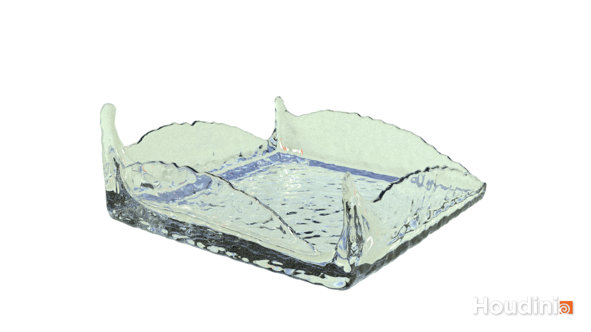

# MatPointMethod

## Nathan Devlin - @ndevlin - ndevlin@seas.upenn.edu - www.ndevlin.com

## Compilation and Running Instructions:

The simulations are done in two .py files; one for elastic materials and one for fluid. 
It is necessary that taichi is installed for the simulation to run. 
If it is, one can compile and run it at the command line or in an IDE like PyCharm, the same as any other taichi program. 
If you would like to view the simulation in real-time in the compressed 2D viewer, simply set the taichi init to arch=ti.gpu, 
and comment out the 4th-to last line of code as noted there to stop PLY writing. 
Note that the simulation is still in 3D but the points will be compressed to their 2D components, effectively giving an orthographic view of the simulation. 
Also note that I was coding on Windows with CUDA GPU architecture, which is where I observed near-realtime GPU performance, performance may be different on a different architecture like metal! 
To view the simulation in full perspective 3D, set the taichi init to CPU and uncomment the writePly() function on the 4th-to last line. 
This will output one PLY file with data for every particle for each frame of the simulation. 
This can then be imported into a program like Houdini for viewing. 

Note that upon running, you may have to wait a few minutes while the taichi code compiles and the data is loaded to the processor, particularly if you are simulating many particles.

Video of the output can be seen at:
https://vimeo.com/501978353

Thank you!
